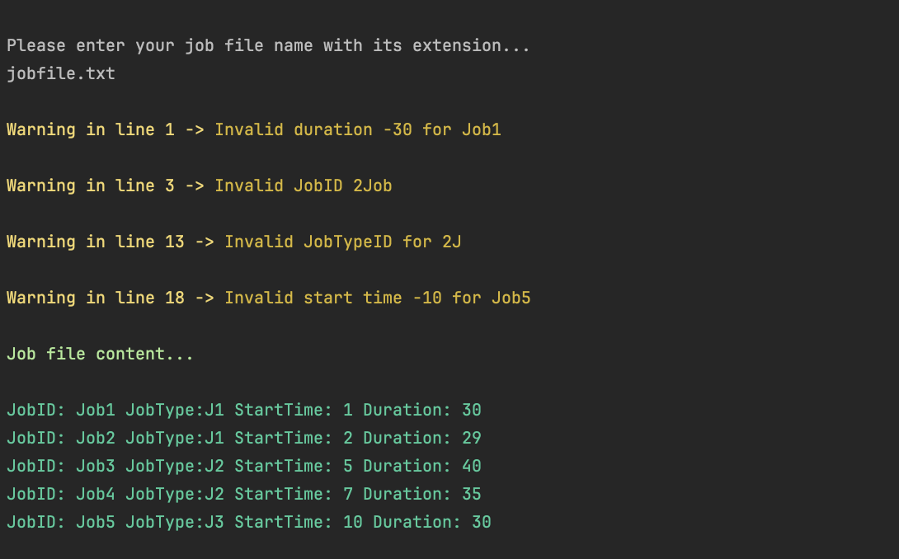
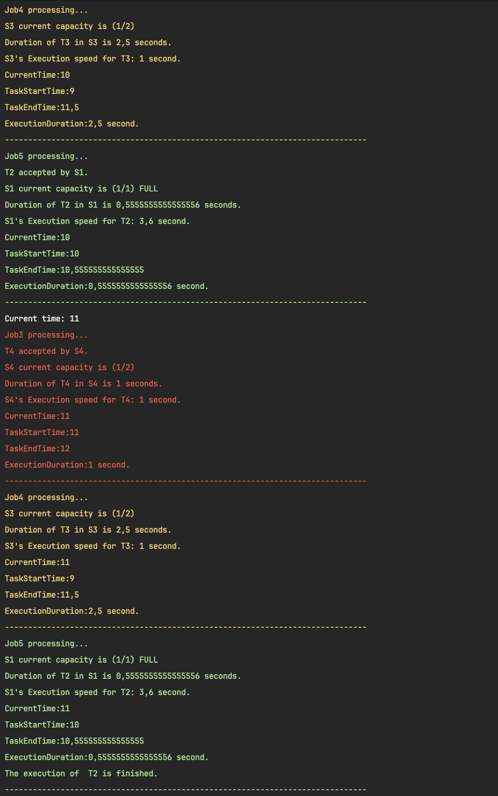

# Task Flow Simulator Outputs

| Workflow.txt Reading                        | Jobfile.txt Reading        |
|---------------------------------------------|----------------------------|
|                     |    |
| Process Started & The  Time From : 1 To : 3 | The  Time From : 4 To : 5  |
|                     |    |
| The  Time From : 5 To : 7                   | The  Time From : 7 To :  8 |
|                     |    |
| The  Time From : 9  To : 10                 | The  Time From : 10 To : 11 |
|                     |    |
| The  Time From : 12 To : 15 & All Finished  |
|                     |